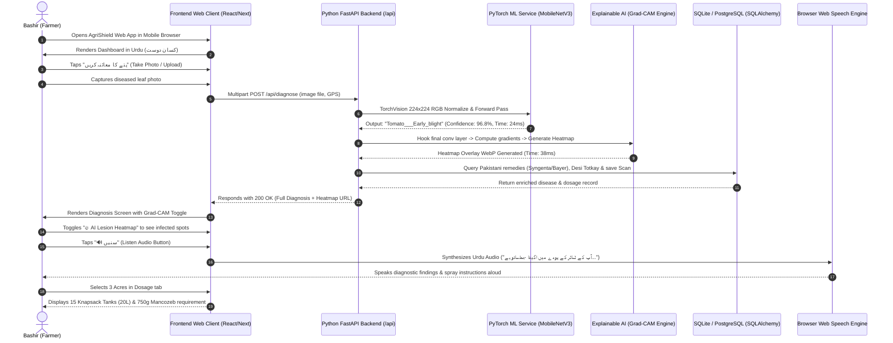
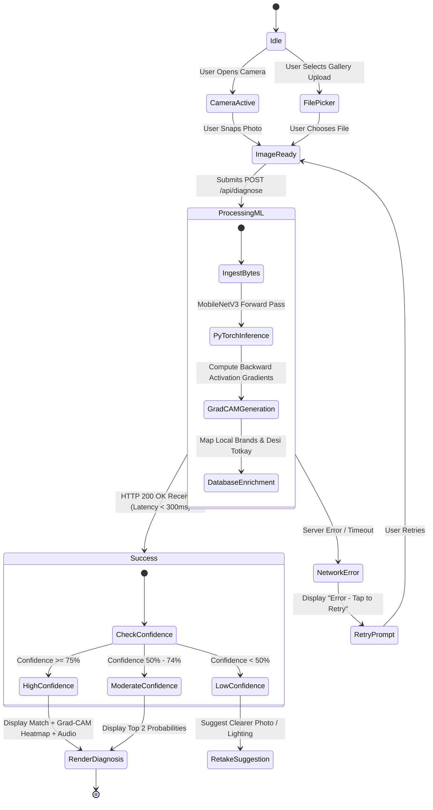

# 🗺️ App Flow, User Journeys & State Machine
## Project: AgriShield (کسان دوست) — AI Crop Disease Diagnostics & Explainable Decision Support System

**Document Version:** 4.0.0 (Custom PyTorch ML + Explainable AI Edition)  
**Focus:** FastAPI API request flows, PyTorch & Grad-CAM pipeline, sequence diagrams, state machines, and multi-lingual user journeys.

---

## 1. Global Sitemap & Route Architecture

```
Frontend Web Client (Next.js / React)
│
├── /onboarding               -> Language Selection & Setup
├── / (Main Dashboard)        -> Hero Scanner, Weather Risk, Recent Scans, Quick Actions
│
├── /scan                     -> Camera Viewfinder & Image Upload Screen
│   └── /scan/result          -> Diagnosis Report, Grad-CAM Heatmap, Urdu Voice Player, Remedies & Dosage
│
├── /diary                    -> Field History & Historical Scan Records
│   └── /diary/[id]           -> Individual Diagnostic Report Detail & WhatsApp Share
│
├── /encyclopedia             -> Crop Disease Catalog & Search
│   └── /encyclopedia/[id]    -> Disease Profile, Pathology & Preventive Manual
│
├── /calculator               -> Standalone Spray Dosage Tool (Acre / Kanal / Marla)
│
└── /advisory                 -> Regional Outbreak Advisory & 1-Tap Agronomist WhatsApp Bridge

Backend Server (Python FastAPI)
│
├── /docs                     -> Interactive Swagger / OpenAPI Documentation
├── /api/diagnose             -> Image Ingestion, PyTorch Classification & Grad-CAM Heatmap Gen
├── /api/diseases             -> Disease Knowledge Base & Remedies Endpoint
├── /api/scans                -> Field Diary Scans Endpoint
└── /api/weather/alerts       -> Live Weather Risk Alert Endpoint
```

---

## 2. End-to-End User Journey Sequence Diagram

### 2.1 Complete Diagnostic & Grad-CAM Heatmap Execution Flow



---

## 3. Diagnostic State Machine Diagram



---

## 4. Screen Navigation & Transition Matrix

| Current Screen | User Action | Target Screen | Transition Effect | Error / Edge Case Fallback |
| :--- | :--- | :--- | :--- | :--- |
| **Home Dashboard** | Tap Camera / Upload CTA | `/scan` | Zoom In | If camera unavailable, opens file picker directly |
| **Camera View** | Snap Photo / Select File | `/scan/result` | Slide Up | Instant loading skeleton during 300ms inference |
| **Diagnosis Screen** | Tap "Grad-CAM Toggle" | Current View | Crossfade Image | Switches between raw leaf and lesion heatmap |
| **Diagnosis Screen** | Tap "Dosage Calculator" | `/scan/result#dosage`| Tab Switch | Auto-calculates for 1 Acre default |
| **Diagnosis Screen** | Tap "WhatsApp Agronomist"| Native WhatsApp | Deep Link | Encodes diagnosis summary into WhatsApp text |
| **Navigation Bar** | Tap "Field Diary" | `/diary` | Instant Fade | Fetches scan history from `GET /api/scans` |
| **Encyclopedia** | Tap any Disease Card | `/encyclopedia/[id]` | Slide Left | Fetches disease profile from `GET /api/diseases/[id]` |
