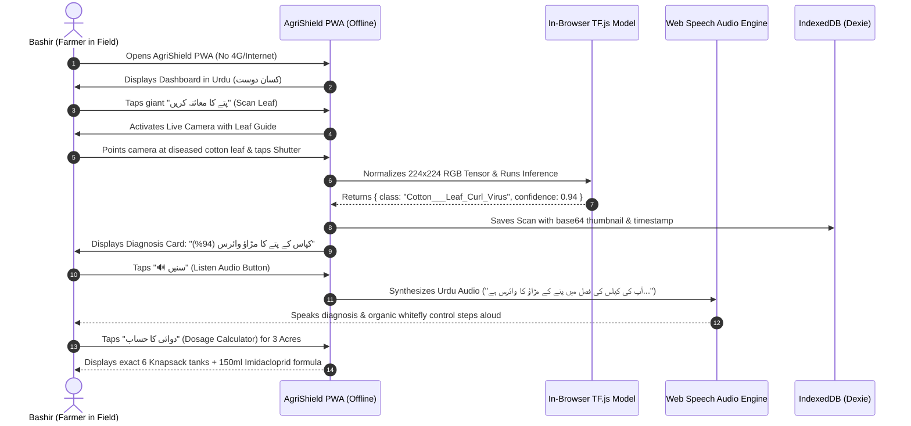
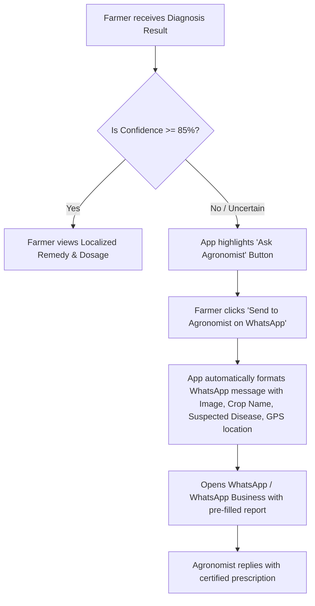
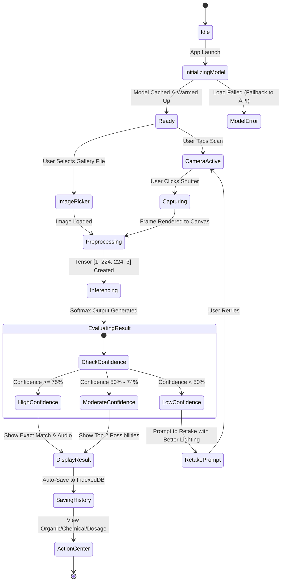
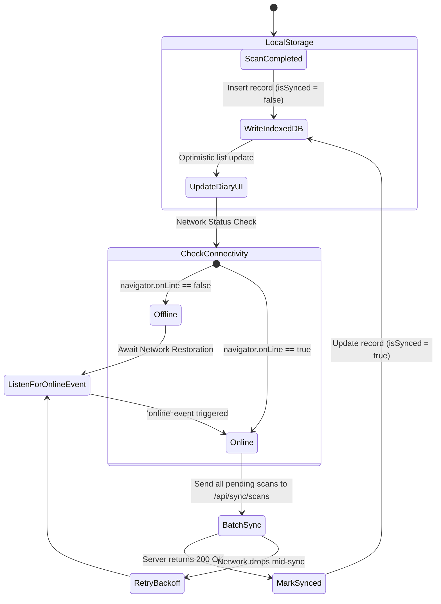

# 🗺️ App Flow, User Journeys & State Machine
## Project: AI-Powered Crop Disease Diagnostics & Decision Support System (AgriShield / Kisan Dost)

**Document Version:** 1.0.0  
**Focus:** Complete navigation topology, state machines, offline handling, and multi-lingual user journeys.

---

## 1. Global Sitemap & Route Architecture

```
/ (Root)
│
├── /onboarding               -> Language Selection & Offline Engine Initialization
├── /home (Main Dashboard)    -> Hero Scanner, Weather Risk, Recent Scans, Quick Actions
│
├── /scan                     -> Live Camera Viewfinder & Image Picker
│   └── /scan/result          -> Diagnosis, Severity, Audio Readout, Organic/Chemical Remedies
│       └── /scan/dosage      -> Integrated Spray & Tank Volume Calculator
│
├── /diary                    -> Field History, Temporal Records & Offline Sync Manager
│   └── /diary/[id]           -> Historical Diagnostic Report Detail & Share
│
├── /encyclopedia             -> 38+ Plant Disease Offline Catalog & Search
│   └── /encyclopedia/[id]    -> Comprehensive Disease Profile & Prevention Manual
│
├── /calculator               -> Standalone Agricultural Chemical & Fertilizer Dosage Tool
│
├── /advisory                 -> Regional Outbreak Heatmap & 1-Tap Agronomist WhatsApp Bridge
│
└── /settings                 -> Language Preference, Offline Cache Management, App Version
```

---

## 2. End-to-End User Journey Walkthroughs

### 2.1 Journey 1: Offline Field Inspection with Urdu Audio (Bashir - Farmer)



---

### 2.2 Journey 2: Escalating to Agronomist via WhatsApp (Dr. Tariq)



---

## 3. Diagnostic State Machine Diagram



---

## 4. Offline Synchronization State Machine



---

## 5. Screen Navigation & Transition Matrix

| Current Screen | User Action | Target Screen | Transition Animation | Fallback / Edge Case |
| :--- | :--- | :--- | :--- | :--- |
| **Splash / Onboarding** | Select Language & Tap Start | `/home` | Slide Left | Auto-detect device language if skipped |
| **Home Dashboard** | Tap Camera CTA | `/scan` | Zoom In | If camera permission denied, opens Gallery selector |
| **Home Dashboard** | Tap Recent Scan Card | `/diary/[id]` | Fade In | Opens cached scan from IndexedDB |
| **Camera Viewfinder** | Tap Shutter Button | `/scan/result` | Shutter Flash + Slide Up | If blur detected, shows stability warning |
| **Camera Viewfinder** | Tap Gallery Icon | Native File Picker | Modal Overlay | Formats JPEG/PNG/WebP automatically |
| **Diagnosis Result** | Tap "Dosage Calculator" | `/scan/result#dosage`| Tab Fade | Defaults to 1 Acre knapsack calculation |
| **Diagnosis Result** | Tap "Save & Finish" | `/diary` | Slide Right | Background syncs if online |
| **Encyclopedia** | Tap any Crop / Disease | `/encyclopedia/[id]`| Slide Left | 100% available offline from local JSON cache |
| **Global Nav** | Tap Offline Status Pill | `/settings` | Modal Pop-up | Displays storage quota and sync queue count |

---

## 6. Error & Edge Case Resolution Flows

```
+-----------------------------+-------------------------------------------------------------+
| Edge Case Scenario          | Graceful Recovery Flow                                      |
+-----------------------------+-------------------------------------------------------------+
| 1. Camera Access Blocked    | Display clear illustration + "Enable Camera" guide. Offer   |
|                             | instant "Upload Photo from Gallery" fallback button.       |
| 2. Low Light / Dark Leaf    | Auto-prompt: "⚠️ Image too dark. Please enable flash or     |
|                             | move to a brighter spot."                                   |
| 3. Blurry / Non-Leaf Image  | Model outputs low entropy score across all plant classes.   |
|                             | Prompt: "🌿 Leaf not detected. Please capture a clear leaf."|
| 4. Device WebGL Unsupported | TF.js automatically falls back to WASM / CPU backend with  |
|                             | graceful performance degradation message.                   |
| 5. Offline Storage Limit    | IndexedDB stores up to 1GB+ without issue; auto-compresses  |
|                             | thumbnails to < 20KB for endless diary logs.                |
+-----------------------------+-------------------------------------------------------------+
```
