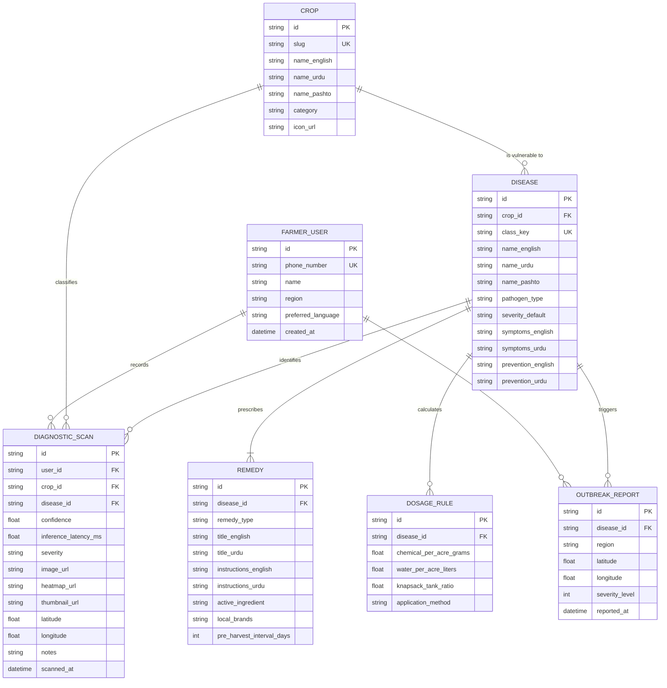

# 🗄️ Backend Architecture & Database Schema
## Project: AgriShield (کسان دوست) — AI Crop Disease Diagnostics & Explainable Decision Support System

**Document Version:** 4.0.0 (Custom PyTorch ML + Explainable AI Edition)  
**Database Strategy:** Python SQLAlchemy 2.0 ORM with SQLite / PostgreSQL, Pydantic v2 validation models, and Explainable AI heatmap storage.

---

## 1. Backend Architecture & Data Topology

AgriShield's backend is a Python FastAPI service hosting the PyTorch Machine Learning inference service, OpenCV-based Grad-CAM heatmap generator, and relational database.

```
+------------------------------------------------------------------------------------+
|                                 CLIENT WEB BROWSER                                 |
|                                                                                    |
|  +------------------------------------------------------------------------------+  |
|  |           Next.js / React Frontend (TypeScript, Tailwind CSS, Lucide)        |  |
|  |     • Submits Multipart Image -> `POST /api/v1/diagnose`                     |  |
|  |     • Fetches Diary Scans   -> `GET  /api/v1/scans`                          |  |
|  |     • Fetches Encyclopedia  -> `GET  /api/v1/diseases`                       |  |
|  +------------------------------------------------------------------------------+  |
+------------------------------------------------------------------------------------+
                                      │
                                      │ HTTPS REST API Calls
                                      ▼
+------------------------------------------------------------------------------------+
|                         PYTHON FASTAPI BACKEND SERVICE                             |
|                                                                                    |
|  +------------------------------------------------------------------------------+  |
|  |                     FastAPI Routers (`app/api/v1/routers/`)                  |  |
|  |  +---------------------------+       +------------------------------------+  |  |
|  |  |   PyTorch & Grad-CAM      |       |      SQLAlchemy 2.0 ORM Layer      |  |  |
|  |  |   • MobileNetV3 Inference |       |   • Async / Sync DB Session Pool   |  |  |
|  |  |   • Grad-CAM Heatmap Gen  |       |   • Pydantic v2 Serialization      |  |  |
|  |  +---------------------------+       +------------------------------------+  |  |
|  +------------------------------------------------------------------------------+  |
|         │                                      │                                   |
|         ▼ (Save Leaf & Heatmap Images)         ▼ (Read / Write Records)            |
|  +---------------------------+       +------------------------------------+        |
|  | Static Image File Storage |       |    SQLite / PostgreSQL Database    |        |
|  | (`backend/static/uploads`)|       |    • Scans, Heatmap URLs, Crops,   |        |
|  | • Leaf Scans & Heatmaps   |       |      Diseases, Remedies & Dosages  |        |
|  +---------------------------+       +------------------------------------+        |
+------------------------------------------------------------------------------------+
```

---

## 2. Entity-Relationship (ER) Diagram



---

## 3. SQLAlchemy 2.0 Database Models (`backend/app/models/models.py`)

```python
import enum
import uuid
from datetime import datetime
from sqlalchemy import Column, String, Float, Integer, Text, Enum, DateTime, ForeignKey
from sqlalchemy.orm import declarative_base, relationship

Base = declarative_base()

class LanguageEnum(str, enum.Enum):
    URDU = "URDU"
    PASHTO = "PASHTO"
    SINDHI = "SINDHI"
    ENGLISH = "ENGLISH"

class PathogenEnum(str, enum.Enum):
    FUNGAL = "FUNGAL"
    BACTERIAL = "BACTERIAL"
    VIRAL = "VIRAL"
    PEST = "PEST"
    HEALTHY = "HEALTHY"

class RemedyTypeEnum(str, enum.Enum):
    ORGANIC = "ORGANIC"
    CHEMICAL = "CHEMICAL"

class SeverityEnum(str, enum.Enum):
    LOW = "LOW"
    MODERATE = "MODERATE"
    HIGH = "HIGH"
    CRITICAL = "CRITICAL"

class Crop(Base):
    __tablename__ = "crops"

    id = Column(String, primary_key=True, default=lambda: str(uuid.uuid4()))
    slug = Column(String, unique=True, index=True, nullable=False)
    name_english = Column(String, nullable=False)
    name_urdu = Column(String, nullable=False)
    name_pashto = Column(String, nullable=True)
    name_sindhi = Column(String, nullable=True)
    category = Column(String, nullable=False)
    icon_url = Column(String, nullable=True)

    diseases = relationship("Disease", back_populates="crop", cascade="all, delete-orphan")
    scans = relationship("DiagnosticScan", back_populates="crop")

class Disease(Base):
    __tablename__ = "diseases"

    id = Column(String, primary_key=True, default=lambda: str(uuid.uuid4()))
    crop_id = Column(String, ForeignKey("crops.id"), nullable=False)
    class_key = Column(String, unique=True, index=True, nullable=False) # e.g. "Tomato___Early_blight"
    name_english = Column(String, nullable=False)
    name_urdu = Column(String, nullable=False)
    name_pashto = Column(String, nullable=True)
    name_sindhi = Column(String, nullable=True)
    pathogen_type = Column(Enum(PathogenEnum), nullable=False)
    severity_default = Column(Enum(SeverityEnum), default=SeverityEnum.MODERATE)
    symptoms_english = Column(Text, nullable=False)
    symptoms_urdu = Column(Text, nullable=False)
    prevention_english = Column(Text, nullable=False)
    prevention_urdu = Column(Text, nullable=False)

    crop = relationship("Crop", back_populates="diseases")
    remedies = relationship("Remedy", back_populates="disease", cascade="all, delete-orphan")
    dosage_rules = relationship("DosageRule", back_populates="disease", cascade="all, delete-orphan")
    scans = relationship("DiagnosticScan", back_populates="disease")

class Remedy(Base):
    __tablename__ = "remedies"

    id = Column(String, primary_key=True, default=lambda: str(uuid.uuid4()))
    disease_id = Column(String, ForeignKey("diseases.id"), nullable=False)
    remedy_type = Column(Enum(RemedyTypeEnum), nullable=False)
    title_english = Column(String, nullable=False)
    title_urdu = Column(String, nullable=False)
    instructions_english = Column(Text, nullable=False)
    instructions_urdu = Column(Text, nullable=False)
    active_ingredient = Column(String, nullable=True) # e.g. "Mancozeb 75% WP"
    local_brands = Column(String, nullable=True) # e.g. "Ridomil Gold (Syngenta), Score 250 EC"
    pre_harvest_interval_days = Column(Integer, default=7)
    safety_warning_urdu = Column(String, nullable=True)

    disease = relationship("Disease", back_populates="remedies")

class DosageRule(Base):
    __tablename__ = "dosage_rules"

    id = Column(String, primary_key=True, default=lambda: str(uuid.uuid4()))
    disease_id = Column(String, ForeignKey("diseases.id"), nullable=False)
    chemical_per_acre_grams = Column(Float, nullable=False) # e.g. 250.0
    water_per_acre_liters = Column(Float, default=100.0)
    knapsack_tank_ratio = Column(Float, nullable=False) # e.g. 50.0g per 20L tank
    application_method = Column(String, default="Foliar Spray")

    disease = relationship("Disease", back_populates="dosage_rules")

class DiagnosticScan(Base):
    __tablename__ = "diagnostic_scans"

    id = Column(String, primary_key=True, default=lambda: str(uuid.uuid4()))
    crop_id = Column(String, ForeignKey("crops.id"), nullable=False)
    disease_id = Column(String, ForeignKey("diseases.id"), nullable=False)
    confidence = Column(Float, nullable=False)
    inference_latency_ms = Column(Float, default=24.0)
    severity = Column(Enum(SeverityEnum), nullable=False)
    image_url = Column(String, nullable=False)
    heatmap_url = Column(String, nullable=True) # Grad-CAM Heatmap Image URL
    thumbnail_url = Column(String, nullable=True)
    latitude = Column(Float, nullable=True)
    longitude = Column(Float, nullable=True)
    notes = Column(String, nullable=True)
    scanned_at = Column(DateTime, default=datetime.utcnow)

    crop = relationship("Crop", back_populates="scans")
    disease = relationship("Disease", back_populates="scans")
```

---

## 4. Pydantic v2 Schemas (`backend/app/schemas/schemas.py`)

```python
from pydantic import BaseModel
from typing import List, Optional
from datetime import datetime
from app.models.models import PathogenEnum, RemedyTypeEnum, SeverityEnum

class RemedySchema(BaseModel):
    remedy_type: RemedyTypeEnum
    title_urdu: str
    instructions_urdu: str
    active_ingredient: Optional[str] = None
    local_brands: Optional[str] = None
    pre_harvest_interval_days: Optional[int] = 7
    safety_warning_urdu: Optional[str] = None

    class Config:
        from_attributes = True

class DosageSchema(BaseModel):
    chemical_per_acre_grams: float
    water_per_acre_liters: float
    knapsack_tank_ratio: float
    application_method: str

    class Config:
        from_attributes = True

class DiagnosisResponse(BaseModel):
    scan_id: str
    image_url: str
    heatmap_url: str # Grad-CAM Visual Heatmap
    thumbnail_url: str
    crop_name: str
    crop_name_urdu: str
    disease_name: str
    disease_name_urdu: str
    disease_name_pashto: Optional[str] = None
    pathogen_type: PathogenEnum
    confidence: float
    inference_latency_ms: float
    severity: SeverityEnum
    audio_urdu_text: str
    remedies: List[RemedySchema]
    dosage: Optional[DosageSchema] = None
    scanned_at: datetime
```
