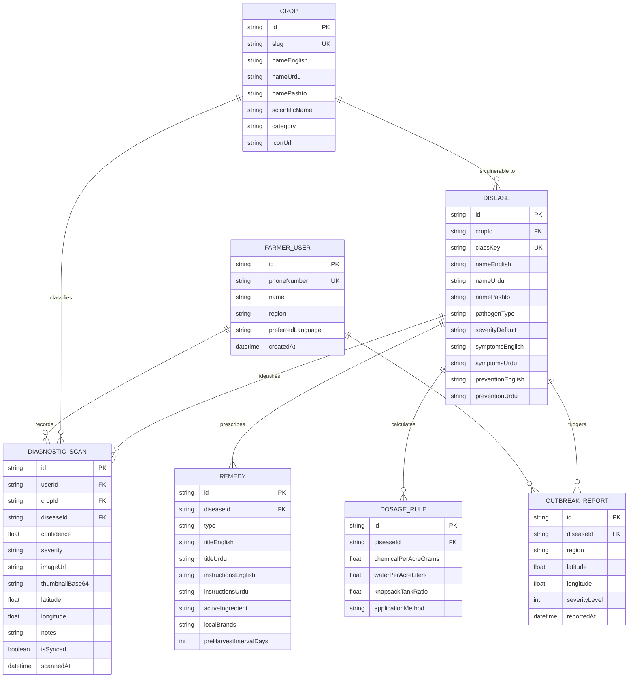

# 🗄️ Backend Architecture & Database Schema
## Project: AI-Powered Crop Disease Diagnostics & Decision Support System (AgriShield / Kisan Dost)

**Document Version:** 1.0.0  
**Data Strategy:** Local-First (IndexedDB via Dexie.js) with Cloud Synchronization (Prisma ORM + PostgreSQL / SQLite).

---

## 1. System Architecture & Data Topology

AgriShield follows a **Local-First, Sync-Second** data lifecycle. The mobile client writes diagnostic records and reads disease knowledge directly from client-side storage (IndexedDB) with $0$ms network latency. When an internet connection becomes available, data asynchronously synchronizes with the server.

```
+------------------------------------------------------------------------------------+
|                                CLIENT STORAGE TIER                                 |
|                                                                                    |
|  +------------------------------------------------------------------------------+  |
|  |                     IndexedDB (Dexie.js Offline Database)                    |  |
|  |   - Table: `scans` (Local Scan History & Base64 Thumbnails)                  |  |
|  |   - Table: `diseases` (Pre-cached 38+ Disease Knowledge Graph)               |  |
|  |   - Table: `crops` (Crop Profiles, Growth Cycles & Regional Seasons)         |  |
|  |   - Table: `sync_queue` (Pending Operations to Push to Server)               |  |
|  +------------------------------------------------------------------------------+  |
+------------------------------------------------------------------------------------+
                                      |   ^
                    Push Pending Logs |   | Pull Outbreak Updates & New Remedies
                                      v   |
+------------------------------------------------------------------------------------+
|                              SERVER / CLOUD DATABASE                               |
|                                                                                    |
|  +------------------------------------------------------------------------------+  |
|  |                  PostgreSQL Database (Managed via Prisma ORM)                |  |
|  |   - Model: `FarmerUser`       - Model: `Crop`                                |  |
|  |   - Model: `Disease`          - Model: `Remedy`                              |  |
|  |   - Model: `DiagnosticScan`   - Model: `DosageRule`                          |  |
|  |   - Model: `OutbreakReport`   - Model: `AgronomistAdvisory`                  |  |
|  +------------------------------------------------------------------------------+  |
+------------------------------------------------------------------------------------+
```

---

## 2. Entity-Relationship (ER) Diagram



---

## 3. Production Prisma Schema (`schema.prisma`)

```prisma
datasource db {
  provider = "postgresql" // Or "sqlite" for lightweight / zero-config local dev
  url      = env("DATABASE_URL")
}

generator client {
  provider = "prisma-client-js"
}

enum Language {
  URDU
  PASHTO
  SINDHI
  ENGLISH
}

enum PathogenType {
  FUNGAL
  BACTERIAL
  VIRAL
  PEST
  DEFICIENCY
  HEALTHY
}

enum RemedyType {
  ORGANIC
  CHEMICAL
  CULTURAL
}

enum SeverityLevel {
  LOW
  MODERATE
  HIGH
  CRITICAL
}

model FarmerUser {
  id                String           @id @default(cuid())
  phoneNumber       String?          @unique
  name              String?
  region            String?          // e.g. "Multan, Punjab"
  preferredLanguage Language         @default(URDU)
  createdAt         DateTime         @default(now())
  updatedAt         DateTime         @updatedAt
  scans             DiagnosticScan[]
  reports           OutbreakReport[]

  @@index([phoneNumber])
}

model Crop {
  id             String           @id @default(cuid())
  slug           String           @unique // e.g. "tomato", "cotton", "wheat"
  nameEnglish    String
  nameUrdu       String
  namePashto     String?
  nameSindhi     String?
  scientificName String?
  category       String           // "Cash Crop", "Vegetable", "Cereal", "Fruit"
  iconUrl        String?
  diseases       Disease[]
  scans          DiagnosticScan[]
  createdAt      DateTime         @default(now())

  @@index([slug])
}

model Disease {
  id                String           @id @default(cuid())
  cropId            String
  crop              Crop             @relation(fields: [cropId], references: [id], onDelete: Cascade)
  classKey          String           @unique // e.g. "Tomato___Early_blight" matching TF.js class
  nameEnglish       String
  nameUrdu          String
  namePashto        String?
  nameSindhi        String?
  pathogenType      PathogenType
  severityDefault   SeverityLevel    @default(MODERATE)
  symptomsEnglish   String           @db.Text
  symptomsUrdu      String           @db.Text
  preventionEnglish String           @db.Text
  preventionUrdu    String           @db.Text
  audioUrlUrdu      String?
  remedies          Remedy[]
  dosageRules       DosageRule[]
  scans             DiagnosticScan[]
  outbreaks         OutbreakReport[]
  createdAt         DateTime         @default(now())

  @@index([cropId])
  @@index([classKey])
}

model Remedy {
  id                      String     @id @default(cuid())
  diseaseId               String
  disease                 Disease    @relation(fields: [diseaseId], references: [id], onDelete: Cascade)
  type                    RemedyType // ORGANIC or CHEMICAL
  titleEnglish            String
  titleUrdu               String
  instructionsEnglish     String     @db.Text
  instructionsUrdu        String     @db.Text
  activeIngredient        String?    // e.g. "Mancozeb 75% WP"
  localBrands             String?    // e.g. "Ridomil Gold, Score, Nativo"
  preHarvestIntervalDays  Int?       @default(7) // Days to wait before harvesting
  safetyWarningEnglish    String?
  safetyWarningUrdu       String?
  createdAt               DateTime   @default(now())

  @@index([diseaseId])
}

model DosageRule {
  id                    String   @id @default(cuid())
  diseaseId             String
  disease               Disease  @relation(fields: [diseaseId], references: [id], onDelete: Cascade)
  chemicalPerAcreGrams  Float    // e.g. 250 (grams or ml)
  waterPerAcreLiters    Float    @default(100) // standard 100L or 200L
  knapsackTankRatio     Float    // e.g. 25 grams per 16L/20L tank
  applicationMethod     String   // "Foliar Spray", "Soil Drench", "Seed Treatment"
  createdAt             DateTime @default(now())

  @@index([diseaseId])
}

model DiagnosticScan {
  id              String        @id @default(cuid())
  userId          String?
  user            FarmerUser?   @relation(fields: [userId], references: [id], onDelete: SetNull)
  cropId          String
  crop            Crop          @relation(fields: [cropId], references: [id])
  diseaseId       String
  disease         Disease       @relation(fields: [diseaseId], references: [id])
  confidence      Float         // e.g. 0.962
  severity        SeverityLevel
  imageUrl        String?       // Cloud URL (if uploaded)
  thumbnailBase64 String        @db.Text // Embedded thumbnail for instant list view
  latitude        Float?
  longitude       Float?
  notes           String?
  isSynced        Boolean       @default(true)
  scannedAt       DateTime      @default(now())

  @@index([cropId])
  @@index([diseaseId])
  @@index([scannedAt])
}

model OutbreakReport {
  id            String        @id @default(cuid())
  diseaseId     String
  disease       Disease       @relation(fields: [diseaseId], references: [id])
  userId        String?
  user          FarmerUser?   @relation(fields: [userId], references: [id], onDelete: SetNull)
  region        String        // e.g. "Rahim Yar Khan, Punjab"
  latitude      Float
  longitude     Float
  severityLevel SeverityLevel
  reportedAt    DateTime      @default(now())

  @@index([diseaseId])
  @@index([latitude, longitude])
}
```

---

## 4. Client-Side Dexie.js Schema (`src/lib/db/dexie.ts`)

```typescript
import Dexie, { Table } from 'dexie';

export interface LocalScan {
  id?: number;
  uuid: string;
  cropSlug: string;
  cropName: string;
  diseaseClassKey: string;
  diseaseName: string;
  diseaseNameUrdu: string;
  confidence: number;
  severity: 'LOW' | 'MODERATE' | 'HIGH' | 'CRITICAL';
  thumbnailBase64: string;
  fullImageBlob?: Blob;
  latitude?: number;
  longitude?: number;
  notes?: string;
  isSynced: boolean;
  timestamp: number;
}

export interface CachedDisease {
  classKey: string;
  cropName: string;
  diseaseName: string;
  diseaseNameUrdu: string;
  symptoms: string;
  symptomsUrdu: string;
  organicRemedy: string;
  organicRemedyUrdu: string;
  chemicalRemedy: string;
  chemicalRemedyUrdu: string;
  localBrands: string;
  dosageGramsPerAcre: number;
}

export class AgriShieldDatabase extends Dexie {
  scans!: Table<LocalScan, number>;
  diseases!: Table<CachedDisease, string>;

  constructor() {
    super('AgriShieldDB');
    this.version(1).stores({
      scans: '++id, uuid, cropSlug, diseaseClassKey, severity, isSynced, timestamp',
      diseases: 'classKey, cropName, diseaseName'
    });
  }
}

export const localDb = new AgriShieldDatabase();
```

---

## 5. Synchronization Protocol & Conflict Resolution

```
SYNC WORKFLOW:
1. Client generates UUID v4 for each scan locally.
2. When online, client queries: `localDb.scans.where({ isSynced: false }).toArray()`.
3. Sends POST request to `/api/sync/scans` with payload array.
4. Server performs idempotent batch upsert based on UUID.
5. Server responds with array of successfully synced UUIDs.
6. Client updates local IndexedDB records: `isSynced = true`.
```
